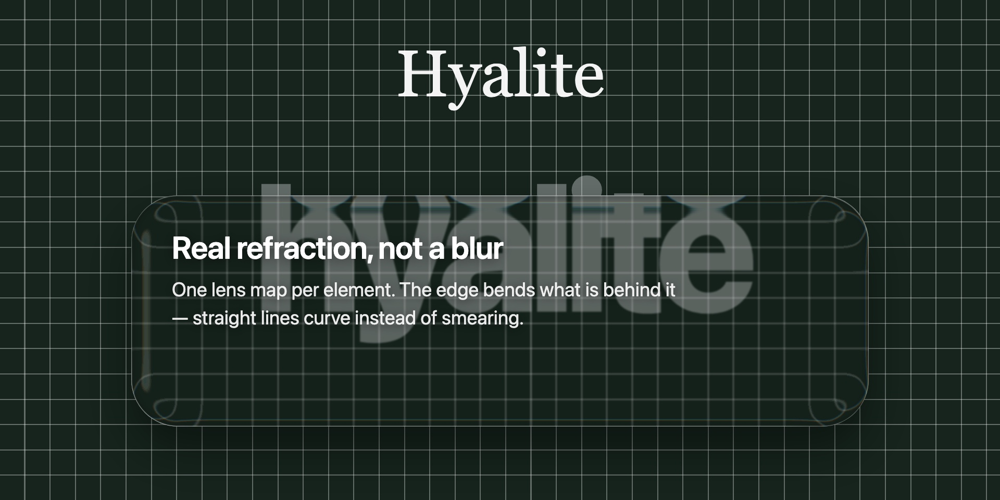
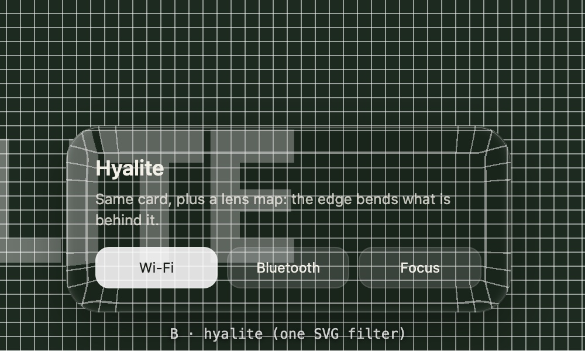
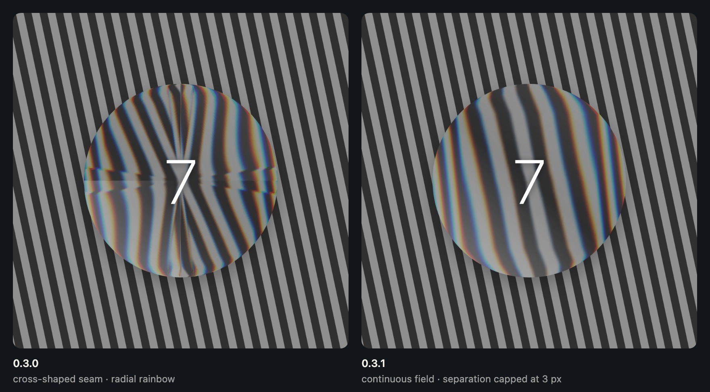

# hyalite

网页上的真折射液态玻璃。一个文件，不用 WebGL，不用构建。

把元素当成一块边缘带倒角的玻璃：按它的尺寸和四个圆角算一张透镜贴图，塞进一个 SVG 滤镜，再用 `backdrop-filter: url(#…)` 让浏览器把元素**背后**的画面弯过去。中心清透；边缘像厚玻璃那样把外面的世界往里拉、在放大的地方压暗，并沿着轮廓接住一道光。直线是弯的，不是糊的。

> 名字来自 hyalite，一种水一样透明、有玻璃光泽的蛋白石。念起来像 highlight，边上那道光正是这个引擎最讲究的东西。

**在线：** [试验台](https://vii-cae.github.io/hyalite--liquid-glass/demo/index.html) · [回归用例](https://vii-cae.github.io/hyalite--liquid-glass/demo/cases.html) —— 用 Chromium 系浏览器打开。



<sub>就是出厂默认那一组，直接来自 <a href="demo/card.html"><code>demo/card.html</code></a>。</sub>

- [`demo/index.html`](https://vii-cae.github.io/hyalite--liquid-glass/demo/index.html) 试验台：同一背景上普通模糊 vs hyalite，可拖、可交换，调倒角 / 厚度 / 模糊 / 色散 / 边缘光，切网格底或上传自己的照片。
  

- [`demo/cases.html`](https://vii-cae.github.io/hyalite--liquid-glass/demo/cases.html) 自检页：不对称圆角、椭圆圆角、CSS 相邻角规则、共用滤镜的双胞胎、尺寸分桶、把贴图读回来验四分之一对称、圆形上不出接缝的方向场、不随透镜放大的色散、从贴图蓝通道读出来的边缘明暗、会折叠的默认档确实走单段、流式长高的气泡，以及把封顶后的值真读回来核对（而不是「没抛异常就算过」）。
- [`demo/run-cases.mjs`](https://github.com/VII-Cae/hyalite--liquid-glass/blob/main/demo/run-cases.mjs) **不是用来打开的页面**，是命令行脚本：把 `cases.html` 放进真正的 headless Chromium 里跑，打印红绿并带退出码。`npm test`，或者 `node demo/run-cases.mjs`（Node 22+，零依赖）。**故意用真实时间**——`--virtual-time-budget` 只快进定时器、不保证出帧，而其中两条用例等的正是帧里才会发生的事（`requestAnimationFrame` 的渐入、`ResizeObserver` 的回退），虚拟时间下它们会报假的失败。

## 用法

```html
<script src="hyalite.js"></script>
```

```css
.glass {
  /* Hyalite 往每个挂上的元素写 --hyalite；别的浏览器用括号里的兜底 */
  backdrop-filter: var(--hyalite, blur(6px));
  -webkit-backdrop-filter: var(--hyalite, blur(6px));
  /* 还有 --hyalite-edge：那道锐利的描边，用 inset 阴影画。这条到哪个浏览器都生效 */
  box-shadow: var(--hyalite-edge, none);
  /* 玻璃自己的颜色画在折射之上，不参与采样 */
  background: rgba(0, 0, 0, .13);
  border-radius: 24px;
}
```

```js
// 盯着容器：现在有的、以后加进来的、以后才获得这个 class 的 .glass 都挂上；移除或失去 class 就撤掉。可以同时有多个
const chat = Hyalite.watch(document.getElementById('app'), '.glass', { bevel: 16, thickness: 10, blur: 3 });
chat.stop();

// 或者一个一个来
Hyalite.attach(card, { bevel: 24, thickness: 10, blur: 0.5, materialize: 220 });
Hyalite.refresh(card);   // 圆角变了但尺寸没变时，强制重算
Hyalite.detach(card);
```

## API

| 调用 | 作用 |
|---|---|
| `Hyalite.watch(container, selector, opts)` → `{ stop }` | 现有的、后来加进来的、后来获得 class 的匹配元素都挂上；移除或失去 class 就撤掉。可以同时有多个 watcher |
| `Hyalite.unwatch()` | 停掉所有 watcher（手动 attach 的不动） |
| `Hyalite.attach(el, opts)` / `Hyalite.detach(el)` | 手动控制单个元素 |
| `Hyalite.refresh(el)` | 按当前几何强制重算 |
| `Hyalite.setOpts(opts)` | 改参数，所有已挂元素分帧重算；返回 Promise。后来的调用会取代先前的 |
| `Hyalite.info()` | 最近一次**建图**的 `{ maxDisplacement, bevel, mapSize, radii, map }` |
| `Hyalite.supported()` | 只有 SVG backdrop 滤镜真能渲染的地方（Chromium）才是 true |
| `Hyalite.force(true \| false \| null)` | 覆盖上面那个判断；传 `null` 回到自动嗅探。返回覆盖后的结论 |
| `Hyalite.DEFAULTS` | 默认参数 |

### 参数

数值参数都会被封到合理范围内。

| 参数 | 默认 | 含义 |
|---|---|---|
| `bevel` | 41 | 边缘弯折带的宽度，px。封到**短边的一半** —— 不再封到圆角，所以圆形能一路弯到中心 |
| `thickness` | 96 | 玻璃厚度，px。决定边缘把背景往里拉多远 |
| `slope` | 2.7 | 位移衰减斜率的上限，px/px。到 1 采样点原地不动；**超过 1 位移就折叠** —— 同一块背景出现两次，「液态」的漩涡就是这么来的。折叠同时也让两段抗阶梯失效（见 `smooth`） |
| `shape` | `squircle` | 倒角的剖面：`circle` / `squircle` / `lip`。squircle 接平板接得比四分之一圆更缓；lip 外沿抬起、往里凹下去，中段倾角变号，于是多出第二组明暗带 |
| `blur` | 1 | 中心的磨砂，px |
| `dispersion` | 1.6 | 色散，单位是**通道分离的像素数** —— 那是玻璃的材料常数，跟透镜多强无关。设 0 只做一次位移，明显更省 |
| `shade` | 0.62 | 边缘压暗多少，0–2。一个数管两件事，比例是调出来的：焦散（边缘放大背景，能量被摊薄）和菲涅尔透射损失 |
| `rim` | 1.76 | 边缘送回多少光，0–4：一层宽的菲涅尔泛光，加一道收紧的高光线。这一份在**滤镜里** —— 像素级锐利的那道外描边看 `edge` |
| `edgeW` | 6.5 | px —— 明暗和泛光往里够多远。故意用绝对像素（见[原理](#原理)规则 3） |
| `edge` | 0.32 | 写进 `--hyalite-edge` 的 CSS 描边强度，0–2。它是画在元素自己身上的 inset 阴影，所以能保持锐利（滤镜里画不出来），而且 Safari 和 Firefox 也吃得到。设 0 写 `none` |
| `light` | −140 | 光的方向，度。0 是正上方，正数顺时针 |
| `smooth` | 1 | px。藏住 Chromium 最近邻采样阶梯的那道模糊（见[原理](#原理)）。夹在两段位移之间，只作用在倒角圈内。**位移折叠时（`slope` > 1）自动忽略** —— 那种情况下根本不存在这个拆分 |
| `materialize` | 0 | ms。attach 时把位移、明暗和边缘光一起从 0 推上来。Apple 的玻璃不是淡入的，是折射长出来的 |
| `settle` | 120 | ms。元素还在变尺寸时先退成同半径的普通模糊；尺寸稳定 `settle` ms 之后重算一次贴图，折射渐入。设 0 走实时模式 |
| `self` | false | 元素用 `filter:` 滤自己，而不是滤背景。只做位移 —— 见[坑](#坑) |
| `onBuild(info)` | — | 每次建**贴图**之后调用（从缓存拿贴图重建滤镜不算）。`info` 带着几何、两张贴图的 URL，以及采样过的边缘剖面 |

默认值是一组**调出来的**参数，不是中性起点：窄倒角 ＋ 很厚的玻璃 ＋ 会折叠的斜率。这样中心保持干净，边缘把背景浓缩成一条带颜色的带；折叠被关在一条窄边里，`blur` 和 `dispersion` 正好盖住它的阶梯。想要安静一点的，把 `slope` 压到 1 以下 —— 漩涡没了，两段抗阶梯回来了。

### 两级缓存

**贴图**只取决于几何 ＋ `bevel` ＋ `thickness` ＋ `light`；**滤镜**在这之上再加 `blur`、`dispersion`、`rim`、`smooth` 和 `self`。建一次贴图总是同时产出两张 PNG（外层和内层那一段），所以切 `smooth` 不用重算。所以 `setOpts({ blur })` 只是重搭几个 DOM 节点，内存里已有的贴图一张都不用重算。

贴图的尺寸会归到桶里（每边最多放大 2%，64px 以内的小元素保持精确），于是一列只差几像素的聊天气泡共用一张贴图，而不是一条消息一张——五十张 canvas 和一张 canvas 的差别。圆角**故意不跟着桶缩放**：预先缩放等于把元素自己的宽度又塞回缓存键里，分桶就白做了。改成让 `feImage` 把桶里的贴图压回真实盒子，常见圆角下轮廓内收不到半个像素。最后一个使用者离开的贴图会先温着，之后按最旧的先淘汰。

`materialize` 的渐入跑在共用滤镜的私有克隆上，动一个元素不会碰到另一个。大元素的贴图会降采样（位移场是平滑的，`feImage` 拉伸回去看不出）。尺寸取排版盒，transform 不会把贴图弄歪。

### 圆角

四角各自的**圆形**半径是精确的：距离场里每个角用自己的半径。倒角不再封到圆角，只封到短边的一半：Apple 的玻璃是一整块透镜 —— 圆形按键一路弯到中心 —— 而锁在圆角上的倒角永远够不到那里。比倒角小的角附近，深度场会在中轴线上打个折，但方向场是按更大的矩形算的，折痕很轻。圆角按 CSS 的相邻角规则处理：只有当同一条边上的两个圆角加起来放不下时，才用**同一个**系数把四个角一起缩小，而不是每个角各自砍到短边的一半。这个区别是看得见的：320×40 的卡片写 `border-radius: 24px 24px 0 0`，浏览器画的就是 24px 的角；按老写法各自砍一刀会算成 20，于是折射的轮廓和真实玻璃边差 4px，边缘光会飘到形状外面去。半径超过短边一半时，靠近边缘（也就是倒角所在的那一圈）是准的，再往里象限 SDF 只是近似。椭圆圆角（`40px / 16px`）按横向那个值近似；百分比按短边算。

方向场按更大的圆角算（规则 3），而**这个放大后的半径封在短边的一半以内**——超过之后圆角矩形的距离函数就不成立了（`W/2 − R` 变负，两个 `q` 项处处为正，整个场退化成一个平移过的圆），梯度会在坐标轴上变号。圆形正好卡在这个上限上，所以 0.3.1 之前**任意倒角**都会把它推过去，画出来是一个十字接缝。现在圆形和胶囊都正常了。



## 原理

1. **距离场。** 圆角矩形（四角各自半径）的有符号距离函数，告诉每个像素它离边缘多深。
2. **斯涅尔定律。** 玻璃是厚 `thickness` 的平板加宽 `bevel` 的四分之一圆倒角。视线在倒角表面折向法线（n = 1.5），再穿过剩余厚度落到背景上，横向偏移就是位移：贴边最大，到倒角内沿归零。
3. **不许折叠。** 位移的衰减斜率封顶 0.85 px/px。到 1 采样点就不动了（无限拉伸），超过 1 画面镜像，边上出现叠线。这是对映射的约束，不是口味参数。
4. **不出阶梯。** Chromium 对被弯折的画面做的是最近邻采样——Skia 的位移效果写死了 `kNearest`（[skbug 40045448](https://issues.skia.org/40045448)）。斜率 0.85 就是 6.7 倍拉伸，边缘上每个源像素都被复制成 6.7px 的方块，玻璃后面任何一条硬边都会变成阶梯。贴图再准也治不了采样器，所以把位移场拆成两段拉伸相等（各约 2.6 倍）的位移，两段合起来**严格**等于单段的场（内层那张表是外层的反函数，不是简单对半）。两段之间加一道 `smooth` 像素的模糊，用倒角圈做遮罩，先把内层那段的阶梯化掉，再让外层去拉伸。6.7px 的满对比阶梯变成约 2.6px、对比只剩一小部分；中心区一点不动。
5. **方向。** 位移沿着一个稍大的圆角矩形（半径＋倒角）的法线**向内**，「竖直往里拉」到「水平往里拉」的转向铺在更长的弧上。按真圆角取方向的话，每个角都像一道棱。放大后的半径封在短边的一半以内，再往上圆角矩形的距离函数就不成立了（见[圆角](#圆角)）。
6. **编码。** 红＝横向偏移，绿＝纵向偏移，128＝不动，蓝＝边缘光（倒角朝光的程度）。贴图是一张 PNG data URL。
7. **滤镜。** `feImage`（贴图）→ `feGaussianBlur`（磨砂）→ 内层 `feDisplacementMap` → 倒角圈遮罩的 `feGaussianBlur`（`smooth`）→ 外层 `feDisplacementMap`（一次，或色散时每个颜色通道一次再用 `feComposite arithmetic` 相加）→ 边缘光叠在上面。`filterUnits="userSpaceOnUse"` 用元素的精确尺寸，`color-interpolation-filters="sRGB"` 让 128 真的等于零。
8. **`backdrop-filter: url(#id)`** 负责剩下的事：实时，对元素背后的一切。

## 浏览器支持

2026 年 9 月测试。

| 引擎 | `backdrop-filter: url(#svg)` | 你看到的 |
|---|---|---|
| Chromium：Chrome、Edge、Arc、Brave、Electron | 渲染 | 折射 |
| WebKit：Safari | 接受属性，丢掉 SVG 部分（[bug 245510](https://bugs.webkit.org/show_bug.cgi?id=245510)，2026 年 9 月已有实现在评审中） | 你写的兜底 |
| Gecko：Firefox | 没有实现 `backdrop-filter` 里的 SVG 滤镜图；从 Firefox 106 起元素按未过滤渲染，不再消失（[bug 1787623](https://bugzilla.mozilla.org/show_bug.cgi?id=1787623)） | 你写的兜底 |

`CSS.supports('backdrop-filter', 'url(#x)')` 在三家都返回 true，所以 `Hyalite.supported()` 还会认一下是不是 Chromium 引擎，别处什么都不写。W3C 有一个[开放的提案](https://github.com/w3c/svgwg/issues/1142)在推动背景位移的标准化；WebKit 发布之后，要改的就是引擎检查那一行——但你不该等我们改。那次嗅探是 2026 年 9 月的一张快照，而 backdrop 滤镜画成什么样是读不回来的，所以它必须留一个逃生舱：`Hyalite.force(true)` 或者在 `<html>` 上写 `data-hyalite="force"`，不用动源码就能把引擎打开；`force(false)` / `data-hyalite="off"` 关掉；`force(null)` 回到自动嗅探。

## 性能

- 每个带 backdrop 滤镜的元素都是一个独立的渲染面。一屏适量的玻璃没问题，几百个不行。`dispersion: 0` 每个面少两次位移和两次合成。`smooth: 0` 少掉内层位移和那道圈内模糊（八个节点），代价是边缘的阶梯回来。
- 贴图在主线程上算（逐像素循环加一次 PNG 编码）。默认的 `settle` 让持续变尺寸的元素只在停下后算一次，而不是每帧一次。贴图封顶约 32 万像素。
- 有两件事把这个循环从关键路径上挪开了：四个角相等时只算左上象限，另外三块镜像过去，逐像素的活少掉约 75%（边缘光本身不是镜像对称的——光是斜着来的——但从镜像后的法线把它还原回来只要一次点积）；以及相近尺寸共用一张贴图，所以一长串聊天记录不会一条消息建一张图。
- 这里故意不给数字；在你自己的目标机器上量。

## 坑

- 放滤镜的隐藏 `<svg>` 不能 `display:none`（Blink 会忽略里面的滤镜）。Hyalite 用 0×0 的盒子。
- `--hyalite` 是会继承的自定义属性。只在被挂上的元素自己身上消费它；子元素再读一次会套上按父元素算的滤镜。
- 三通道色散相加只对不透明源成立。半透明层的 alpha 会被加三遍再截到 1，颜色按预乘值压暗——`self: true` 就是为了避开它（只做位移）。
- 形状变形的元素（药丸长成卡片）：变形期间自己把 `--hyalite` 写成 `blur(你的模糊px)`，落定后再带 `materialize` 挂上。贴图是按尺寸算的，别挂到还在变形的元素上。
- 贴图是 `data:` URL，严格的 CSP 需要 `img-src data:`。

## 致谢与先行者

Apple 的 Liquid Glass（WWDC25）给了「玻璃该弯光而不是散射光」这个想法。圆角矩形 SDF → 折射 → 位移贴图 → `feDisplacementMap` 这条路已有不少项目走过，[kube.io](https://kube.io/blog/liquid-glass-css-svg/) 的物理推导最清楚。Hyalite 自己的实现取舍是：不折叠约束、大圆方向场、四角各自半径、按真实元素尺寸建图、settle / materialize 行为、私有的渐入克隆，以及一套能在真实页面上活下来的 watch/attach API。

工程实现：Claude Fable 5.1（0.1.0，以及 0.3.0：藏住 Chromium 最近邻阶梯的两段位移、`smooth`）与 Claude Opus 5（0.2.0：两级缓存与尺寸分桶、圆角的 CSS 相邻角规则、四分之一对称、`light`、`force`，以及一个把值真读回来核对的自检页；0.3.1：把圆形修好的方向场封顶；0.4.0：边缘明暗 —— 贴图蓝通道里那条带符号的剖面和应用它的乘法层 —— 可选的倒角剖面、可选的折叠、CSS 描边，以及「什么该按比例、什么必须按像素」这条分界），都来自 Anthropic，都与 VII-Cae 结对完成；VII-Cae 负责方向、每一版的目测验收和每一个参数的手调。

MIT © 2026 VII-Cae
